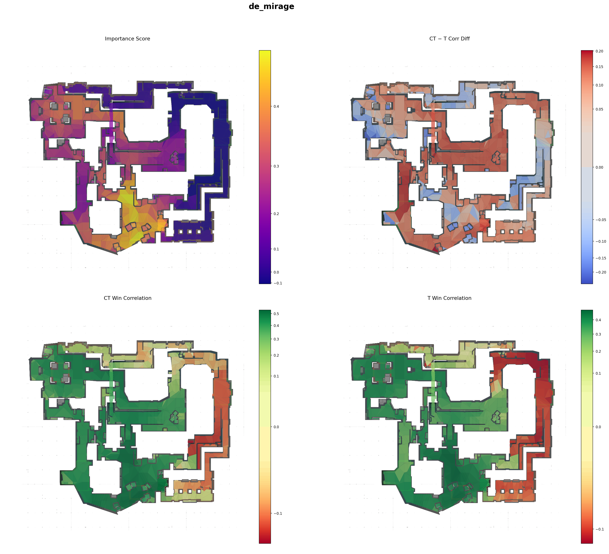
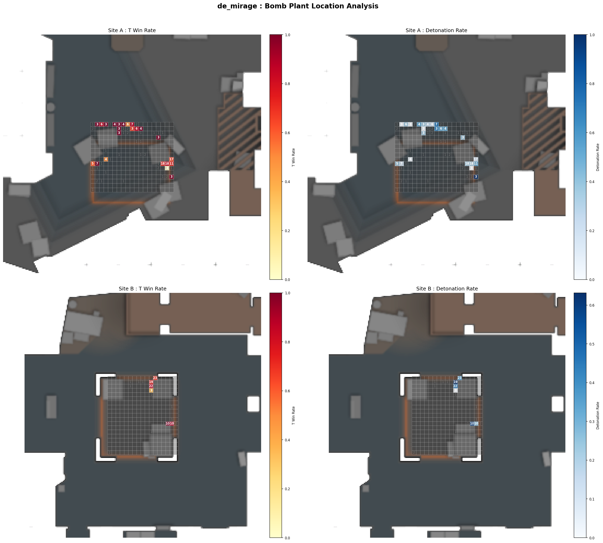

# Map Control Analysis

A CS2 demo analysis pipeline that quantifies **map control**, **area importance**, and **bomb plant patterns** from match replays. Raw `.dem` files are parsed tick-by-tick, analysed using vision cones and Dijkstra-based mobility frontiers, and stored in a relational database for downstream querying and visualisation.

---

## How It Works

### Map Control Algorithm (`internal/statistics/mapcontrol.py`)

For each round we calculate:

- **Vision cones** per-player
- **Sighting events** 
- **Mobility frontiers**, expanded via Dijkstra from each player's position, blocked by areas currently visible to the opposing team.
- **Nav areas** are classified into four states:
  - `active` — exclusively reachable by one team and within their vision.
  - `passive` — exclusively reachable by one team but not directly watched by that team.
  - `contested` — reachable by both teams simultaneously.
  - `neutral` — reached by neither team.
- Per-player metrics (active %, unique area %, denial %, clearance) are accumulated and written to the database.

### 3. Analysis Scripts (`scripts/`)

| Script | Description |
|---|---|
| `map_control_test.py` | Parse a single demo, print per-round map control averages to stdout — no DB required. |
| `area_importance_heatmap.py` | Render a heatmap of **nav area importance**: Pearson correlation between area control and round win rate, split by T/CT side. |
| `positional_importance.py` | Render a heatmap of **positional importance**: correlation between time spent in an area and winning, plus average presence rates. |
| `plant_location_importance.py` | Render per-site heatmaps of **bomb plant locations** coloured by T win rate and detonation rate. |
| `extract_bomb_plants.py` | Back-fill bomb plant events (location, site, detonated) for all already-processed demos. |

---

## Example Output

### Area Importance — de_mirage

Computed from all processed demos. Each nav area is coloured by its correlation with round wins. Areas with fewer than 20 rounds of data are shown in dark gray.

- **Top-left**: Aggregate importance score (average of T and CT correlations).
- **Top-right**: CT − T correlation difference — blue areas favour CTs, red areas favour Ts.
- **Bottom row**: Per-side win correlations.



### Bomb Plant Location Analysis — de_mirage

Each plant location is bucketed into a fixed-size grid cell and coloured by outcome. 

- **Left column**: T-side win rate when the bomb is planted at that cell.
- **Right column**: Bomb detonation rate when planted at that cell.



## Requirements & Setup

- Python 3.11+
- MySQL database (connection details via `.env`)
- [AWPY](https://github.com/pnxenopoulos/awpy) for demo parsing

```bash
pip install -r requirements.txt   # or use the project virtual environment
```

Key environment variables (`.env`):

```
DEMO_DIR=/path/to/demos
DB_HOST=localhost
DB_PORT=3306
DB_USER=...
DB_PASS=...
DB_NAME=mapcontrol
```

Run the ingestion pipeline:

```bash
python main.py
```

Run a quick single-demo test without a database:

```bash
python scripts/map_control_test.py path/to/demo.dem
```

Generate area importance heatmaps (requires a populated database):

```bash
python scripts/area_importance_heatmap.py
```

